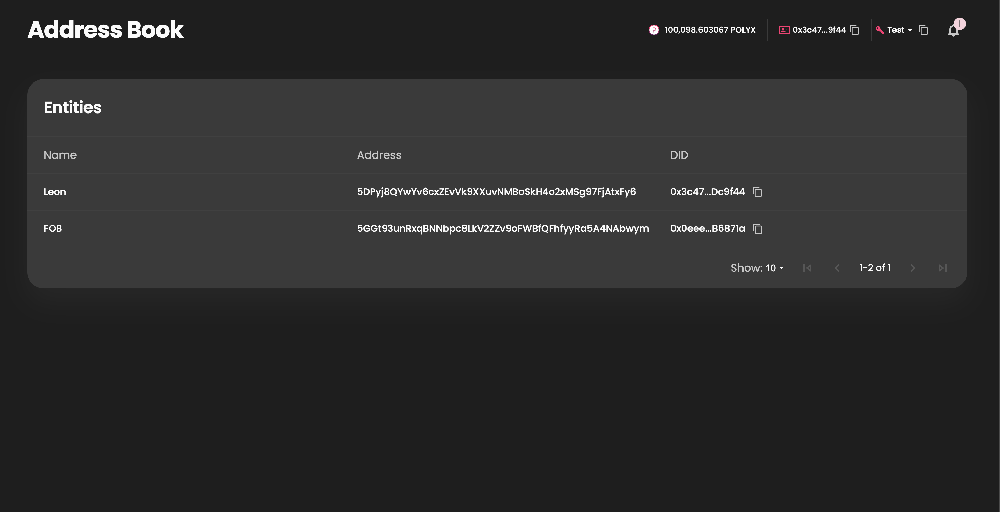
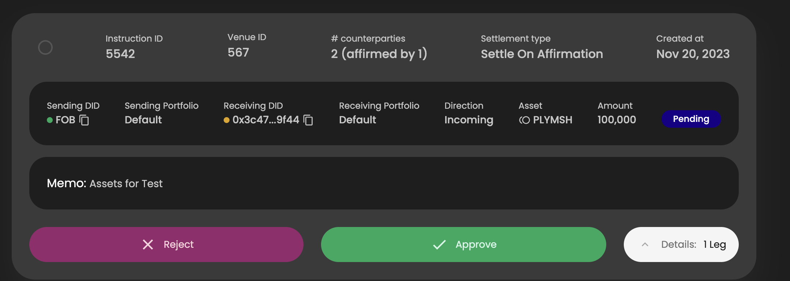

# Polymesh Association Grant Proposal

- **Project Name:** Address Book
- **Team Name:** Leon Prouger
- **Payment Address:**
- **Level:** 1

## Project Overview :page_facing_up:

### Overview

The project introduces an address book to the Polymesh portal, allowing users to assign name tags to DID and its the associated keys. This addition aims to enhance the overall user experience of the portal, making it easy to perform and oversee transactions with the help of the address book.

### Project Details

#### Address Book Page

When accessing the address book page, user is presented with a table displaying address book entities with fields such as name tag, DID, and key (primary). The available actions include adding, removing, or editing items within the address book. Users can conveniently search the address book, and there are options for exporting and importing items to and from CSV

The address book entities are stored in local storage, making it accessible within the user's browser environment only.

#### Address Entity popup

The address entity popup appears whenever a user intends to add, edit, or simply view an address book entity. Also it includes a dedicated field for textual notes. Additionally, when a DID is inputted, the associated account keys are automatically retrieved presented to the user.

#### Name tag funcionality

The name tag will be displayed alongside the user's DID on all portal screens. Additionally, when performing transfers and other actions, users can select a recipient by the name tag, while the associated DID is automatically fetched in the background. Displaying the user tag instead of keys associated with the DID can also be done if it heplful.

* *The mocks are for presentation purposes only and do not represent the final version.*

### Ecosystem Fit

Address book enhace the user experience of the polymesh portal.

## Team :busts_in_silhouette:

### Team members

### Contact

- **Contact Name:** Leon Prouger
- **Contact Email:** leonprou@gmail.com
- **Website:** https://github.com/leonprou

### Legal Structure

- **Registered Address:** 
- **Registered Legal Entity:**

### Team's experience

I have 10 years of engineering experience - JS, TS, Python, Rust. And 5 years working with blockchain - Solidity, EVM, Web3. I led the development of Fuse Network, and its Wallet as a service platform. I also was involed in the release of https://safe.fuse.io/.

### Team Code Repos

Provide the address of the github org and repos where the completed project will be hosted
- https://github.com/leonprou
- https://github.com/leonprou/polymesh-portal

Please also provide the GitHub accounts of all team members. If they contain no activity, references to projects hosted elsewhere or live are also fine.

- https://github.com/leonprou

### Team LinkedIn Profiles (if available)

- https://www.linkedin.com/in/leon-prouger-60646540/

## Development Status :open_book:

I have a PoC version that presents address book with a mock data.

## Development Roadmap :nut_and_bolt:

### Overview

- **Total Estimated Duration:** 1 month
- **Full-Time Equivalent (FTE):** 0.56
- **Total Costs:** 7.5K USD

### Milestone 1 — Implement Address Book

- **Estimated duration:** 1 month
- **FTE:** 0.56
- **Costs:** 7.5K USD

| Number | Deliverable | Specification |
| -----: | ----------- | ------------- |
| 0.a  | Specification | Product and technical specification of the overall feature
| 0.b | PoC | PoC in a defined scope to prove the feasibility and understand the codebase
| 1. | Feature: Address book page | Address book page with seach that loads data from local storage.
| 2. | Feature: Address Entity popup | Address entity pop for adding and ediding entites. Entity includes name tag, DID, account keys that fetched by DID, and optional fields for test notes.
| 2. | Feature: Import and Export | Importing and exporing entity book data.
| 2. | Feature: Import and Export | Importing and exporting to a CSV file.
| 3. | Feature: Name tag display | Displaying the name tag in addition to the DID.
...

## Future Plans

In the future the account key functionality in the address book can be improve:
- dedicated tab for address book entities tagged by key (instead DID)
- displaying seconday keys that are related to the DID in form of `leon.secondary`

*Note:The suggestions can be included in the proposal as the second milestone.*

## Additional Information :heavy_plus_sign:

**How did you hear about the Grants Program?** personal recommendation.

I gained familiarity with the codebase through the execution of a time-bound PoC. This exercise was pivotal in assessing the proposal's feasibility and in comprehending the full extent of the work required